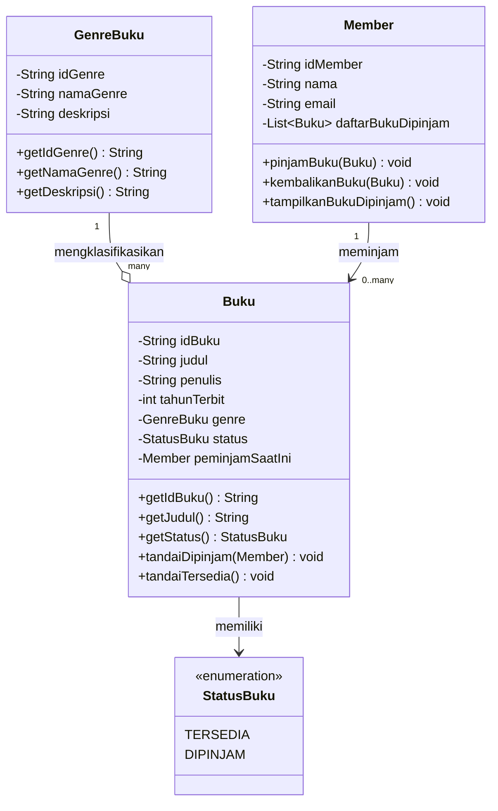

# Class Diagram - Sistem Perpustakaan

**Penjelasan relasi:**
- **GenreBuku – Buku** (Agregasi, 1 ke banyak): satu genre dapat dimiliki oleh banyak buku, dan genre tetap bisa berdiri sendiri walau belum ada buku yang memakainya.
- **Member – Buku** (Asosiasi, 1 ke banyak): satu member dapat meminjam banyak buku sekaligus, tetapi satu buku hanya bisa dipinjam oleh satu member pada satu waktu (dilacak lewat atribut `peminjamSaatIni` di kelas `Buku`).
- **Buku – StatusBuku**: setiap buku memiliki status `TERSEDIA` atau `DIPINJAM` yang berubah lewat method `tandaiDipinjam()` / `tandaiTersedia()`.
