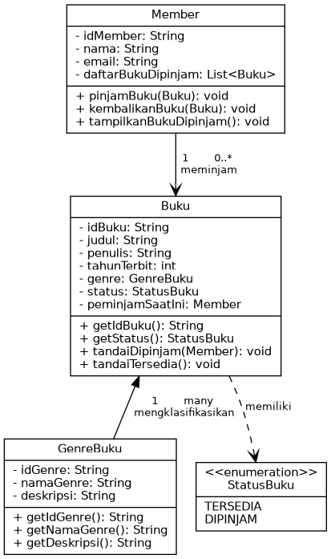

**Mata Kuliah:** Pemrograman Berorientasi Objek
**Topik:** Class Diagram & Implementasi Sistem Perpustakaan

**Repositori GitHub:** https://github.com/onefatir/tugas-oop-perpustakaan

---

## 1. Deskripsi Sistem

Sistem yang dibangun adalah simulasi sederhana **manajemen peminjaman buku di perpustakaan**,
yang merelasikan tiga entitas utama sesuai ketentuan tugas:

- **Member** — anggota perpustakaan yang dapat meminjam dan mengembalikan buku.
- **Buku** — entitas buku fisik yang dapat dipinjam, memiliki status ketersediaan.
- **GenreBuku** — kategori/genre dari sebuah buku (misalnya Fiksi, Sains).

Selain itu ditambahkan satu tipe pendukung, **StatusBuku**, berupa `enum` untuk merepresentasikan
status ketersediaan buku (`TERSEDIA` / `DIPINJAM`) secara type-safe.

---

## 2. Class Diagram



---

## 3. Analisis Relasi Antar Kelas

### 3.1 Relasi `GenreBuku` — `Buku` (Agregasi, 1 ke banyak)

Satu `GenreBuku` dapat dimiliki oleh banyak objek `Buku`, namun satu `Buku` hanya memiliki
tepat satu `GenreBuku`. Ini adalah relasi **agregasi**, karena `GenreBuku` memiliki siklus hidup
independen — ia tetap valid untuk ada meskipun belum ada `Buku` yang mereferensikannya (misalnya
genre baru yang didaftarkan sebelum ada bukunya).

Secara implementasi, `Buku` menyimpan referensi langsung ke objek `GenreBuku`:
```java
private GenreBuku genre;
```

### 3.2 Relasi `Member` — `Buku` (Asosiasi, 1 ke banyak, dua arah)

Satu `Member` dapat meminjam **banyak** `Buku` sekaligus (disimpan dalam `List<Buku> daftarBukuDipinjam`),
namun satu `Buku` hanya dapat dipinjam oleh **satu** `Member` pada satu waktu. Relasi ini bersifat
**dua arah** (bidirectional association):

- `Member` menyimpan daftar buku yang sedang dipinjamnya.
- `Buku` menyimpan referensi ke `Member` yang sedang meminjamnya (`peminjamSaatIni`), sehingga sistem
  dapat langsung mengetahui siapa peminjam suatu buku tanpa perlu menelusuri semua Member.

Enkapsulasi dijaga dengan membuat method `tandaiDipinjam()` dan `tandaiTersedia()` pada `Buku`
bersifat **package-private**, sehingga hanya bisa dipanggil dari dalam alur `pinjamBuku()` /
`kembalikanBuku()` milik `Member` — mencegah kode luar mengubah status buku secara sembarangan.

### 3.3 Relasi `Buku` — `StatusBuku` (Ketergantungan tipe)

`Buku` bergantung pada `enum StatusBuku` untuk merepresentasikan kondisinya saat ini. Penggunaan
`enum` (dibanding `String` atau `boolean`) membuat status lebih **type-safe** dan mudah dikembangkan
(misalnya menambah status `HILANG` atau `RUSAK` di kemudian hari tanpa mengubah logika inti).

### 3.4 Ringkasan Prinsip OOP yang Diterapkan

| Prinsip | Penerapan |
|---|---|
| **Enkapsulasi** | Semua atribut bersifat `private`, diakses lewat getter; perubahan status buku hanya lewat method terkontrol |
| **Abstraksi** | `Member` tidak perlu tahu detail internal `Buku`, cukup memanggil `pinjamBuku()` / `kembalikanBuku()` |
| **Asosiasi & Agregasi** | Dimodelkan lewat referensi objek antar kelas (`genre`, `peminjamSaatIni`, `daftarBukuDipinjam`) |
| **Single Responsibility** | Setiap kelas punya satu tanggung jawab jelas: `Member` mengurus aksi peminjam, `Buku` mengurus data & status buku itu sendiri |

---

## 4. Kode Program

Kode lengkap tersedia di repositori GitHub: **https://github.com/onefatir/tugas-oop-perpustakaan**

Struktur berkas:
```
src/
├── GenreBuku.java
├── Buku.java
├── Member.java
├── StatusBuku.java
└── Main.java
```

### 4.1 GenreBuku.java
```java
public class GenreBuku {
    private String idGenre;
    private String namaGenre;
    private String deskripsi;

    public GenreBuku(String idGenre, String namaGenre, String deskripsi) {
        this.idGenre = idGenre;
        this.namaGenre = namaGenre;
        this.deskripsi = deskripsi;
    }

    public String getIdGenre() { return idGenre; }
    public String getNamaGenre() { return namaGenre; }
    public String getDeskripsi() { return deskripsi; }

    @Override
    public String toString() {
        return namaGenre + " (" + idGenre + ")";
    }
}
```

### 4.2 StatusBuku.java
```java
public enum StatusBuku {
    TERSEDIA,
    DIPINJAM
}
```

### 4.3 Buku.java
```java
public class Buku {
    private String idBuku;
    private String judul;
    private String penulis;
    private int tahunTerbit;
    private GenreBuku genre;
    private StatusBuku status;
    private Member peminjamSaatIni;

    public Buku(String idBuku, String judul, String penulis, int tahunTerbit, GenreBuku genre) {
        this.idBuku = idBuku;
        this.judul = judul;
        this.penulis = penulis;
        this.tahunTerbit = tahunTerbit;
        this.genre = genre;
        this.status = StatusBuku.TERSEDIA;
        this.peminjamSaatIni = null;
    }

    public String getIdBuku() { return idBuku; }
    public String getJudul() { return judul; }
    public String getPenulis() { return penulis; }
    public int getTahunTerbit() { return tahunTerbit; }
    public GenreBuku getGenre() { return genre; }
    public StatusBuku getStatus() { return status; }
    public Member getPeminjamSaatIni() { return peminjamSaatIni; }

    void tandaiDipinjam(Member peminjam) {
        this.status = StatusBuku.DIPINJAM;
        this.peminjamSaatIni = peminjam;
    }

    void tandaiTersedia() {
        this.status = StatusBuku.TERSEDIA;
        this.peminjamSaatIni = null;
    }

    @Override
    public String toString() {
        String infoPeminjam = (status == StatusBuku.DIPINJAM && peminjamSaatIni != null)
                ? ", dipinjam oleh: " + peminjamSaatIni.getNama()
                : "";
        return String.format("[%s] \"%s\" - %s (%d) | Genre: %s | Status: %s%s",
                idBuku, judul, penulis, tahunTerbit, genre.getNamaGenre(), status, infoPeminjam);
    }
}
```

### 4.4 Member.java
```java
import java.util.ArrayList;
import java.util.List;

public class Member {
    private String idMember;
    private String nama;
    private String email;
    private List<Buku> daftarBukuDipinjam;

    public Member(String idMember, String nama, String email) {
        this.idMember = idMember;
        this.nama = nama;
        this.email = email;
        this.daftarBukuDipinjam = new ArrayList<>();
    }

    public String getIdMember() { return idMember; }
    public String getNama() { return nama; }
    public String getEmail() { return email; }
    public List<Buku> getDaftarBukuDipinjam() { return daftarBukuDipinjam; }

    public void pinjamBuku(Buku buku) {
        if (buku.getStatus() == StatusBuku.TERSEDIA) {
            buku.tandaiDipinjam(this);
            daftarBukuDipinjam.add(buku);
            System.out.println(nama + " berhasil meminjam buku \"" + buku.getJudul() + "\".");
        } else {
            System.out.println(nama + " GAGAL meminjam \"" + buku.getJudul()
                    + "\" karena sedang dipinjam oleh " + buku.getPeminjamSaatIni().getNama() + ".");
        }
    }

    public void kembalikanBuku(Buku buku) {
        if (daftarBukuDipinjam.remove(buku)) {
            buku.tandaiTersedia();
            System.out.println(nama + " mengembalikan buku \"" + buku.getJudul() + "\".");
        } else {
            System.out.println(nama + " tidak sedang meminjam buku \"" + buku.getJudul() + "\".");
        }
    }

    public void tampilkanBukuDipinjam() {
        System.out.println("Daftar buku yang dipinjam oleh " + nama + ":");
        if (daftarBukuDipinjam.isEmpty()) {
            System.out.println("  (tidak ada buku yang sedang dipinjam)");
        } else {
            for (Buku b : daftarBukuDipinjam) {
                System.out.println("  - " + b.getJudul());
            }
        }
    }

    @Override
    public String toString() {
        return String.format("[%s] %s (%s)", idMember, nama, email);
    }
}
```

### 4.5 Main.java
```java
public class Main {
    public static void main(String[] args) {
        System.out.println("=== SIMULASI SISTEM PERPUSTAKAAN ===\n");

        GenreBuku fiksi = new GenreBuku("G01", "Fiksi", "Cerita rekaan/imajinatif");
        GenreBuku sains = new GenreBuku("G02", "Sains", "Buku ilmu pengetahuan populer");

        Buku buku1 = new Buku("B01", "Laskar Pelangi", "Andrea Hirata", 2005, fiksi);
        Buku buku2 = new Buku("B02", "Sapiens", "Yuval Noah Harari", 2011, sains);
        Buku buku3 = new Buku("B03", "Bumi Manusia", "Pramoedya Ananta Toer", 1980, fiksi);

        Member member1 = new Member("M01", "Fatir", "fatir@example.com");
        Member member2 = new Member("M02", "Dinda", "dinda@example.com");

        member1.pinjamBuku(buku1);
        member1.pinjamBuku(buku2);
        member2.pinjamBuku(buku3);
        member2.pinjamBuku(buku1); // gagal, sudah dipinjam member1

        member1.tampilkanBukuDipinjam();
        member2.tampilkanBukuDipinjam();

        member1.kembalikanBuku(buku1);
        member2.pinjamBuku(buku1); // berhasil, sudah dikembalikan
    }
}
```

---

## 5. Hasil Eksekusi Program

Program telah dijalankan dan diuji dengan hasil sebagai berikut (cuplikan output konsol):

```
=== SIMULASI SISTEM PERPUSTAKAAN ===

-- Proses Peminjaman --
Fatir berhasil meminjam buku "Laskar Pelangi".
Fatir berhasil meminjam buku "Sapiens".
Dinda berhasil meminjam buku "Bumi Manusia".
Dinda GAGAL meminjam "Laskar Pelangi" karena sedang dipinjam oleh Fatir.

-- Proses Pengembalian --
Fatir mengembalikan buku "Laskar Pelangi".

-- Buku1 Dipinjam Ulang oleh Member2 --
Dinda berhasil meminjam buku "Laskar Pelangi".
```

Output ini membuktikan bahwa relasi antar kelas berfungsi sebagaimana dirancang: satu buku
tidak dapat dipinjam dua orang sekaligus, dan status buku otomatis diperbarui saat dipinjam
maupun dikembalikan.

---

## 6. Kesimpulan

Implementasi ini menunjukkan bagaimana prinsip OOP — enkapsulasi, abstraksi, serta relasi
asosiasi dan agregasi — dapat digunakan untuk memodelkan sistem dunia nyata (perpustakaan)
menjadi struktur kelas yang jelas, mudah dipelihara, dan mudah dikembangkan lebih lanjut
(misalnya menambah fitur denda keterlambatan, riwayat peminjaman, atau reservasi buku).
